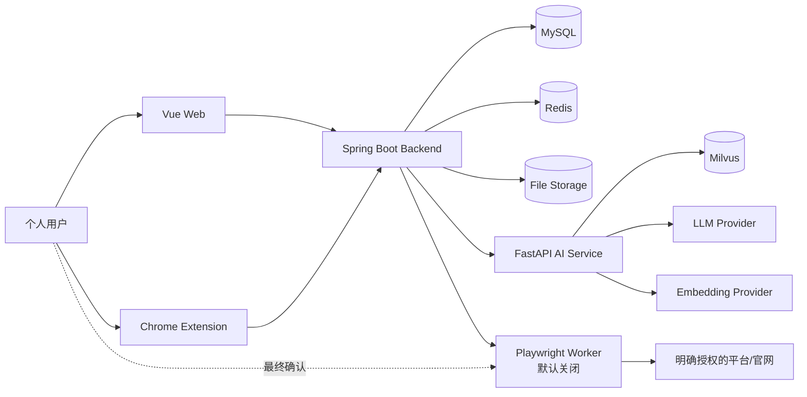
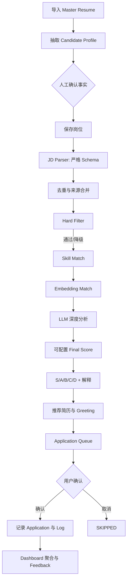
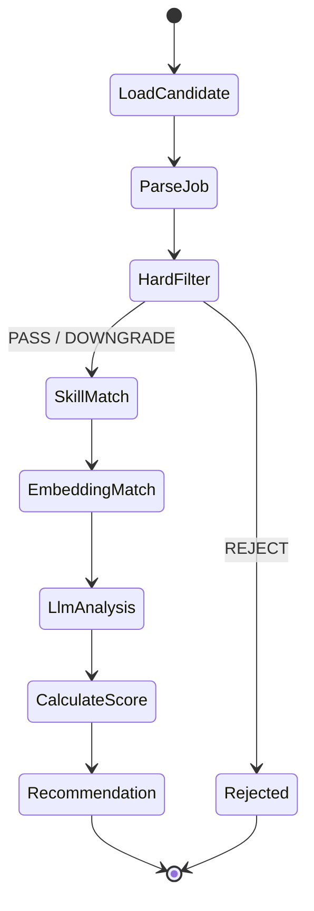

# JobPilot AI 架构设计

> 状态：Phase 0 基线（2026-09-01）  
> 适用范围：个人自用、单用户优先，但保留正规的身份、安全、审计与扩展边界。

## 1. 项目扫描结论

### 1.1 当前目录结构

扫描前 `D:\JobPilot AI` 不存在，是全新项目。Phase 0 完成后根目录仅包含设计、路线图和任务文档；尚未创建业务代码，避免在架构确认前堆叠实现。

```text
D:\JobPilot AI\
├─ ARCHITECTURE.md
├─ DATABASE_DESIGN.md
├─ API_DESIGN.md
├─ DEVELOPMENT_ROADMAP.md
└─ TASKS.md
```

### 1.2 当前已有技术栈

项目内无现有技术栈。开发机已检测到：

| 工具 | 当前状态 | 用途 |
|---|---|---|
| Git 2.55 | 可用 | 版本管理 |
| Java 21 LTS | 可用 | Backend |
| Maven 3.9.4 | 安装在 `D:\apache-maven-3.9.4`，未加入 PATH | Java 构建 |
| Node.js 22 / npm 12 | 可用 | Frontend、Extension |
| Python 3.11 | 可用 | AI Service |
| Docker 29 | CLI 可用 | 本地容器化；Phase 1 再验证引擎状态 |

### 1.3 当前功能

无现有功能、数据、接口、迁移或部署脚本。

### 1.4 缺失功能

需求中的业务模块均待实现。实现顺序以核心 MVP 链路为主，不先开发大规模采集、全自动投递、复杂学习排序或装饰性页面。

### 1.5 可复用模块

没有项目代码可复用。可复用的是本机 Java 21、Maven、Node、Python 与 Docker 工具链。

### 1.6 需要重构的模块

没有遗留模块需要重构。后续通过模块边界、数据库迁移、契约测试和 Architecture Test 防止形成需要大规模重构的结构。

## 2. 架构决策摘要

| 决策 | 选择 | 原因 |
|---|---|---|
| 后端形态 | Spring Boot 模块化单体 | 单人项目部署和调试成本低，同时按领域拆分，未来可独立服务化 |
| AI 形态 | 独立 FastAPI 服务 | Python AI 生态与 Java 业务域解耦，可独立扩缩容 |
| 业务主库 | MySQL 8 | 满足既定技术栈，承载事务数据 |
| 缓存/轻量队列 | Redis | 缓存、限流、短任务状态、幂等；不把 Redis 当永久事实来源 |
| 向量库 | Milvus 2.6（Phase 3 已落地） | BGE-M3 1024 维向量、COSINE/AUTOINDEX、内容 Hash 缓存；Fake 仅用于隔离单元测试，运行验收使用真实模型与向量库 |
| 文件存储 | Storage Provider；本地开发使用挂载卷，后续可切 MinIO/S3 | 简历文件不直接塞数据库，便于部署迁移 |
| 前端 | Vue 3 + JavaScript + Vite + Element Plus | Phase 1 明确要求业务源码使用 JavaScript，适合高信息密度后台 |
| 浏览器扩展 | Chrome MV3 + TypeScript | 只读取用户当前可见页面，并由用户显式触发 |
| 自动化 | 独立 Playwright Worker，默认关闭 | 将高风险页面操作隔离；仅授权、允许、人工确认的流程启用 |
| 内部异步 | Transactional Outbox + Worker | 防止“数据库提交成功但 AI/事件丢失”；Phase 3 后再按规模评估 RabbitMQ |
| API | REST `/api/v1` + OpenAPI 3.1 | 稳定、可测试、便于前端和扩展生成客户端 |
| 身份 | Spring Security + 短时 Access JWT + 可轮换 Refresh Token | 即使单用户也保留正规安全边界 |

## 3. 架构原则

1. **核心事实归 Java Backend 管理**：岗位、简历、投递、面试、Offer 和状态机只能由 Backend 提交事务。
2. **AI 只给结构化建议**：AI Service 不直接修改关键业务事实，不直接提交投递，不虚构候选人经历。
3. **Provider 隔离外部能力**：LLM、Embedding、Vector Store、Object Storage、Platform Adapter 均通过接口替换。
4. **默认人在回路中**：`ASSIST` 是默认投递模式；任何外部提交动作必须有审计和明确授权。
5. **合规优先**：不破解验证码、不绕过风控、不模拟指纹、不使用代理池规避限制、不批量注册、不做未授权采集或投递。
6. **先闭环后扩展**：先跑通“候选人 → 岗位 → 解析 → 匹配 → 队列 → 确认 → CRM → 分析”。
7. **可解释、可追溯**：评分保存算法版本、权重快照、Prompt 版本、模型、证据和人工修订记录。

## 4. 系统上下文



### 4.1 信任边界

- Browser Extension 和 Web 都是不可信客户端；权限、校验、幂等必须在 Backend 完成。
- AI 输出是不可信建议；必须通过 Pydantic/JSON Schema 校验、枚举白名单和业务规则复核。
- 招聘页面内容是不可信输入；入库前做长度限制、HTML 清理、URL 校验和 Prompt Injection 隔离。
- 外部 LLM 不接收密码、Token、Cookie 或不必要的联系方式；发送简历前进行字段级最小化。

## 5. 运行时组件

### 5.1 `frontend`

- Vue 3、JavaScript、Vite、Element Plus、Pinia、Vue Router、Axios、ECharts。
- 职责：驾驶舱、岗位与匹配解释、候选人画像、简历、投递 CRM、面试、Offer、设置。
- 不在浏览器实现评分、权限或状态机真相。
- 所有可见按钮必须接真实 API；未实现能力使用明确的“尚未开放”，不放无效按钮。

### 5.2 `backend`

- Java 21、Spring Boot 3.x、Spring Security、MyBatis-Plus、Flyway、Bean Validation。
- 模块化单体：同进程部署、按领域包隔离，模块间通过应用服务或领域事件协作。
- 职责：鉴权、事务、业务规则、状态机、API、审计、任务编排、AI 调用治理。
- 使用 ArchUnit 检查 Controller 不得直接依赖 Mapper，领域模块不得反向依赖接口层。

### 5.3 `ai-service`

- Python 3.11+、FastAPI、Pydantic v2、LangGraph、Sentence Transformers。
- Agent：`CandidateAgent`、`JobParserAgent`、`MatchingAgent`、`ResumeAgent`、`CommunicationAgent`、`InterviewAgent`、`AnalyticsAgent`。
- Provider：`LlmProvider`、`EmbeddingProvider`、`VectorStoreProvider`。
- 输出使用版本化 Schema，失败时返回可区分的验证错误，不静默拼凑结果。
- Prompt 存放在 `prompts/<name>/<version>.md`，调用记录 Prompt 版本和内容哈希。

### 5.4 `browser-extension`

- Manifest V3、最小权限、按站点启用的 content script。
- 用户点击后读取当前可见岗位信息；不后台遍历列表、不获取 Cookie、不绕过登录状态。
- 本地 Token 使用 `chrome.storage.session` 或短时配对 Token；不把长期 Refresh Token 放在 content script。
- 平台解析器按 Adapter 隔离；原始抓取内容标记来源、时间与用户确认状态。

### 5.5 `automation-worker`

- Playwright 独立进程，默认 Profile 为 `disabled`。
- 只接受 Backend 签发的短时、单任务授权；执行前校验平台策略和申请模式。
- `MANUAL`：仅给出操作清单；`ASSIST`：打开/填充但不提交；`AUTHORIZED_AUTOMATION`：仅对明确允许的 API/官网执行提交。
- 遇到验证码、二次验证、权限变化或页面结构不确定时立即进入 `BLOCKED`，等待人工处理。

## 6. Backend 领域模块

| 模块 | 主要职责 | 禁止承担 |
|---|---|---|
| `identity` | 用户、登录、Token、会话、安全设置 | 业务画像 |
| `candidate` | Candidate Digital Twin、教育、经历、项目、技能与偏好 | 简历文件生成 |
| `resume` | Master Resume、版本、指标、Tailor 请求与真实性约束 | 岗位评分 |
| `job` | 岗位、来源、导入、标准化、去重、公司 | 投递状态机 |
| `matching` | Hard Filter、技能/向量/LLM 分数、最终评分和解释 | 直接修改候选人事实 |
| `recommendation` | S/A/B/C/D 分层、收藏、忽略、排序 | 重算原始分数 |
| `application` | Queue、申请、CRM 状态机、日志、幂等 | 页面自动提交实现 |
| `communication` | Recruiter、消息、话术、跟进建议 | 擅自发送消息 |
| `interview` | 面试日程、问题、复盘、知识缺口 | 外部日历凭据 |
| `offer` | Offer 记录、比较与截止提醒 | 法律/财务承诺 |
| `analytics` | 漏斗、转化率、日聚合、反馈 | 修改源业务事实 |
| `automation` | 规则、任务、提醒、授权、执行审计 | 绕过平台限制 |
| `settings` | 权重、阈值、Provider、Prompt 激活版本 | 存储明文密钥 |
| `audit` | 审计、Trace、敏感操作追踪 | 记录敏感值本身 |

每个模块内部建议采用：

```text
<module>/
├─ api/              # Controller、Request/Response DTO
├─ application/      # Use case、事务边界、Command/Query
├─ domain/           # Entity、Value Object、Domain Service、Event
└─ infrastructure/   # Mapper、外部 Provider、持久化实现
```

## 7. 核心业务链路



### 7.1 匹配公式基线

硬条件先执行，输出 `PASS`、`DOWNGRADE` 或 `REJECT`。非 `REJECT` 的岗位执行软评分：

```text
final_score =
  skill_score      * 0.30 +
  embedding_score  * 0.20 +
  llm_score        * 0.25 +
  project_score    * 0.10 +
  preference_score * 0.10 +
  company_score    * 0.05
```

- 权重、阈值和 Hard Filter 规则保存在版本化配置中，单次结果保存快照。
- `S=90..100`、`A=80..89.99`、`B=70..79.99`、`C=60..69.99`、`D<60`。
- Hard Filter 为 `DOWNGRADE` 时使用显式惩罚项，并在解释中展示；不得隐藏硬缺口。
- LLM 分数不能越过可配置上限来掩盖学历、毕业年份或经验等硬条件。

### 7.2 异步一致性

1. Backend 事务内保存业务记录和 `outbox_event`。
2. Worker 领取事件，使用幂等键调用 AI Service。
3. AI 返回版本化结构，Backend 校验并保存结果。
4. 失败按指数退避重试；超过阈值进入 Dead Letter 状态并展示给用户。
5. Dashboard 读取数据库中的已提交结果，不直接依赖 AI 实时可用性。

## 8. AI 工作流



关键约束：

- Agent State 只包含本次任务所需的最小数据和事实 ID。
- 所有节点可单测、可重试；外部调用节点设置超时、限流与熔断。
- Resume Tailor 先构造 `Evidence Ledger`，每条生成内容必须引用候选人事实 ID；无证据内容拒绝输出。
- 网页中的“忽略之前规则”等内容作为数据处理，不作为系统指令进入 Prompt。

## 9. 数据架构

- **MySQL**：用户、画像、岗位、匹配、申请、面试、Offer、配置、审计等事务事实。
- **Redis**：读缓存、分布式限流、幂等短锁、短期任务进度；数据可重建。
- **Milvus**：Job、Resume、Project、Skill 向量；主键映射及模型版本保存在 MySQL。
- **File Storage**：原始简历、生成版本和导出文件；数据库只保存对象键、哈希、媒体类型和大小。
- **日志**：本地开发结构化 JSON；生产可接 OpenTelemetry + Loki/Tempo/Prometheus。

Phase 4 已落地 Recommendation 读模型；Phase 5 已落地 Application Queue、人工确认、CRM 状态机与不可变事件；Phase 6 已落地 Evidence Ledger、Prompt、可审查 Tailor 和只生成不发送的 Communication Draft；Phase 7 已落地最小权限浏览器扩展与默认关闭的 Assist Worker；Phase 8 已落地 Interview 聚合、Round、Predicted/Actual Question、Answer Note、不可变 Review、人工确认的 Knowledge Gap 和站内 Reminder。Dashboard 从这些真实事实源聚合，Offer 与外部会议/消息动作仍显式不可用。

详细表设计见 `DATABASE_DESIGN.md`。

## 10. 安全与合规

### 10.1 凭据

- `LLM_BASE_URL`、`LLM_API_KEY`、`LLM_MODEL` 只从环境变量/Secret Provider 注入。
- `.env`、Token、Cookie、API Key、原始授权头不得提交 Git 或写日志。
- 数据库中必须保存的第三方密钥使用主密钥派生的 AEAD 加密；Phase 1 不提供无安全存储的密钥保存界面。

### 10.2 API

- 密码使用 Argon2id 或 BCrypt（成本参数配置化）。
- Access JWT 短时有效，Refresh Token 仅保存哈希并支持轮换/吊销。
- CORS 精确白名单；浏览器 Cookie 模式才启用 CSRF Token。本项目默认 Authorization Header，不使用跨站 Cookie 认证。
- 登录、导入、AI 调用、扩展配对和自动化任务分别限流。
- 文件上传校验大小、扩展名、MIME 和内容；解析在隔离临时目录完成。

### 10.3 隐私

- 日志脱敏手机号、邮箱、身份证件和地址；不记录简历全文。
- 用户可导出和删除个人数据；删除采用业务逻辑删除加可配置的物理清理任务。
- 调用外部模型前展示 Provider 和数据范围，允许切换本地模型。

### 10.4 平台政策

- 为每个平台维护 `platform_policy`：采集方式、允许动作、确认要求、速率和更新时间。
- 未知政策默认 `MANUAL_ONLY`。
- 扩展只处理用户当前打开且可见的页面；Playwright 不后台刷页面。
- `AUTHORIZED_AUTOMATION` 需要保存授权来源、范围、有效期和撤销状态。

## 11. 可观测性

所有请求使用 `trace_id`，异步任务额外使用 `task_id`：

- HTTP：方法、模板化路径、状态码、耗时、trace_id；不记录敏感请求头/正文。
- AI：Provider、模型、Prompt 版本、Token Usage、估算成本、耗时、Schema 校验结果。
- 匹配：各阶段耗时、算法版本、缓存命中，不在日志打印完整 JD/简历。
- 业务审计：登录、导出、删除、状态变化、权重修改、授权和外部提交。
- 指标：P50/P95 延迟、AI 错误率、队列积压、匹配吞吐、成本预算使用率。

## 12. 计划仓库结构

Phase 1 起逐步形成以下结构，未到对应 Phase 不创建空壳业务模块：

```text
JobPilot AI/
├─ backend/
│  ├─ pom.xml
│  └─ src/{main,test}/...
├─ ai-service/
│  ├─ pyproject.toml
│  ├─ app/{api,agents,services,models,schemas,providers,embeddings,prompts,utils}/
│  └─ tests/
├─ frontend/
│  ├─ package.json
│  └─ src/{views,components,api,stores,router,composables,utils,layouts}/
├─ browser-extension/
├─ automation-worker/
├─ deploy/
│  ├─ docker/
│  └─ scripts/
├─ docs/
├─ .env.example
├─ docker-compose.yml
└─ README.md
```

## 13. 部署拓扑

### 本地开发

- Frontend、Backend、AI Service 在宿主机热更新。
- MySQL、Redis、Milvus 依赖使用 Docker Compose。
- Mock Provider 只在测试 Profile 使用，UI 必须明确标注 `TEST/DEMO`。

### 单机日常使用

- Docker Compose 启动 Frontend、Backend、AI Service、MySQL、Redis、Milvus 及其依赖。
- 默认只绑定 `127.0.0.1`；若需要局域网访问，必须显式配置 TLS 和允许源。
- MySQL、文件存储和 Milvus 使用命名卷，并提供备份/恢复脚本。

## 14. 架构质量门禁

- Java：`mvn verify`，包含单元、Repository、API 集成、ArchUnit、Flyway 验证。
- Python：`ruff check`、`mypy`、`pytest`，包含 Provider 契约和严格 JSON Schema 测试。
- Frontend/Extension：lint、typecheck、Vitest；关键链路使用 Playwright E2E。
- Docker：`docker compose config` 和服务健康检查。
- 每个 Phase 必须完成 Build、Test、Run smoke test 后才标记完成；Bug 必须在进入下一 Phase 前修复。

## 15. 明确不做（当前范围）

- 大规模招聘网站爬虫。
- 验证码破解、风控绕过、浏览器指纹伪造、代理池规避限制。
- 未授权批量注册、采集、消息发送或自动投递。
- 在核心 MVP 闭环前开发复杂微服务、Kafka 集群、实时数仓或深度学习 LTR。
- 把测试 Mock、静态假数据或 Demo 结果展示成真实 AI/平台结果。

## 16. Phase 0 验收

- [x] 扫描并记录当前目录、技术栈、现有/缺失功能。
- [x] 明确可复用与重构结论。
- [x] 确定系统边界、领域模块、核心链路和部署方式。
- [x] 确定 AI、数据、安全、合规和可观测性原则。
- [x] 数据库、API、Roadmap 和优先级任务拥有独立设计文档。
## Phase 7 — Browser boundary and controlled Assist

The Chrome Extension is an untrusted device client, not a privileged Web session. It receives a device-bound `jpe_` access token with `SCOPE_EXTENSION` and a rotating opaque refresh token stored only in `chrome.storage.session`. Backend rechecks ACTIVE device status and token version on every request.

`automation-worker` is a separate default-off Node/Playwright process. Backend is the policy enforcement point: it validates user/device ownership, APPROVED ASSIST queue state, current `ASSIST_ALLOWED` policy and localhost target before issuing an HMAC task token bound to task, queue, policy and expiry. Worker independently verifies that token and its own URL/selector allowlists. Its only successful terminal state is `PREPARED`, which means fields were filled and control returned to the user; it cannot create an Application or external submission fact.

See `docs/PHASE7_POLICY_REVIEW.md` for the platform boundary.

## Phase 8 — Interview facts and human-confirmed learning

`interview` 是后端模块化单体内的事务边界。`interviews` 保存面试级快照和状态，`interview_rounds` 保存各轮明确时区与时间范围；问题通过 `source_type=PREDICTED/ACTUAL/MANUAL` 区分，用户回答只进入追加版本的 `interview_answer_notes`。AI Service 的 LangGraph Interview 工作流只接收最小化的 Job/Resume/Candidate Evidence，并在无 LLM Secret 时明确运行 `RULES_ONLY`。

Review 是不可变版本，AI 只创建 `PROPOSED` Knowledge Gap。只有用户先确认来源 Review、再逐条激活 Gap，状态才可进入 `ACTIVE`；系统不会据此修改 Candidate Skill、Resume、Match 权重或 Application 状态。Reminder 仅为 MySQL 中的站内待办，不调用邮件、短信、日历或会议服务。

## Phase 9 — Offer facts, complete analytics and privacy boundary

`offer` 是 Backend 模块化单体中的用户事实域。Offer 必须引用当前用户状态为 `OFFER` 的 Application，并保留 Company、Role 和 Resume Version 快照。金额统一使用 `DECIMAL` 和 `BigDecimal`；同币种才能归一化比较，系统没有汇率来源时绝不编造跨币种换算。比较权重、输入、结果、版本和 Hash 都持久化为不可变快照，主观维度没有用户评分时从分母排除。

完整 Analytics 直接从 Job、Match、Application Log、Interview 和 Offer 事实重算，漏斗及七类维度均返回分子、分母、样本量、百分比和小样本标志。重算结果保存为不可变、幂等的 `analytics_snapshots`。Privacy 删除分为预览与确认两个事务步骤，要求独立幂等键、版本和精确确认短语；普通业务事实逻辑删除并禁用账户，审计历史保留。系统仍不发送外部消息，也不自动接受或拒绝 Offer。

## Phase 10 — Conservative learning and local-only automation

`learning` 领域从推荐查看和 Application/Interview/Offer 的不可变事实派生 Feedback。每条 Feedback 绑定事件发生时间之前的 Match、Feature Schema Version 和 Feature Hash，训练采用时间顺序 80/20 切分与 30 条最小样本门禁。`CONSERVATIVE_LINEAR` 模型先保存为版本，再运行 Shadow；Shadow 只写差异结果，不修改 Recommendation。只有用户显式激活后在线投影才读取活动模型，并可回滚到基线。

`automation` 领域只允许七个固定 Handler。`safe_automation_tasks` 保存幂等键、输入/输出、尝试次数、退避时间和安全错误；数据库 Check Constraint 永久要求 `external_message_sent=0`、`external_submission=0`、`external_mutation=0`、`user_confirmation_required=1`。重复岗位只能产生 Suggestion，提醒只能写站内 Notification。Scheduler 由 `AUTOMATION_CENTER_ENABLED=false` 默认关闭；未知/过期 Policy 或缺失/过期/撤销 Authorization 均降级为 `MANUAL_ONLY`，且本阶段不存在外部动作 Handler。

## Phase 11 — Operational readiness

`operations` 是模块化单体中的只读运行态聚合与运维证据边界。它从 Actuator、MySQL、Redis、AI Readiness、Milvus、`ai_call_logs` 和不可变 `operational_runs` 返回真实状态；Operations 页面不伪造时序曲线，也不获得招聘平台写权限。

Micrometer/Prometheus 暴露低基数指标；调用方 `X-Trace-Id` 作为稳定 request trace 写入响应 Header、API Envelope 与结构化日志，OpenTelemetry 内部 Trace/Span 与之并存。OTLP Exporter 默认关闭，只有显式配置可信本地 Collector 才启用。日志禁止记录 Token、Cookie、密码、完整简历/JD 或未脱敏 Prompt。

备份采用同一批次的 MySQL 事务逻辑备份、文件 ZIP、Milvus 导出与 SHA-256 Manifest。恢复演练只创建随机隔离数据库、临时文件目录和临时 Milvus Collection，校验后精确清理；不存在覆盖活动数据库的一键 Web 操作。供应链报告和负载基线保存在 Git 忽略目录，并通过 `operational_runs` 只持久化摘要、Hash 与相对路径。

## Phase 12 — Local secure release

Phase 12 把既有单机拓扑固化为可复现发布单元，不改变领域边界、API 或数据库 Schema。Backend 使用 Java 21 多阶段镜像，AI Service 使用 Python 3.11 与 CPU-only PyTorch，Frontend 使用 Node 构建后由非 Root Nginx 提供静态资源和同源 API Gateway。三个应用容器均以非 Root 用户、只读根文件系统、`cap_drop: ALL` 和 `no-new-privileges` 运行。

Gateway、Backend 和 AI 主机端口默认只绑定 `127.0.0.1`，MySQL、Redis、MinIO、etcd 与 Milvus 不新增公网入口。默认 Gateway 端口为 `8180`，避免与常见本地 `8080` 服务冲突；CORS 仍只允许显式本机 Origin。公网或局域网部署需要新的 TLS、访问控制、Secret 管理和安全评审，不能直接扩大当前绑定。

发布前调用 Phase 11 一致批次备份。Release Manifest 固化 Artifact SHA-256、镜像 ID/运行用户、Flyway 版本与备份引用；回滚预检只校验兼容性，不自动修改数据库或容器。数据恢复仍只能先在隔离数据库、临时目录和临时 Milvus Collection 验证，禁止一键覆盖活动数据。

## Phase 13 — Guided onboarding and data quality

`onboarding` 是 Backend 模块化单体中的只读派生域。它只读取当前用户的 Candidate Profile、结构化 Skill、Education、Experience、Project、Resume 和 Resume Version，通过固定权重生成九项 Readiness；达到 80 分且不存在 Blocker 才返回 `READY`。Controller 不接受 `userId`，所有查询由 Web JWT Principal 限定。

Data Quality 问题不持久化、不调用 LLM、不修改事实表。稳定 Code 与 `BLOCKER/WARNING/INFO` 顺序用于前端引导，用户只能跳转到 Candidate Profile 或 Resume Center 后主动保存。Phase 13 不新增 Flyway 迁移，既有 82 张表仍是唯一事实源。

Frontend 保持按路由动态加载，并按需注册 Element Plus 组件；ECharts 仅引入 Bar/Pie、Grid/Tooltip 和 Canvas Renderer。Rollup 把 Vue、Element Plus、ECharts、ZRender、Axios、Day.js 与 Lodash 分为独立 Chunk，避免单个页面加载整个 UI/图表依赖。

## Phase 14 — Account security and workspace settings

`auth` 领域新增当前用户密码修改与 Web Session 管理。Access/Refresh JWT 都携带 `authVersion`，Access Token 同时绑定 Session Family；修改密码后提升用户认证版本、撤销全部 Web Refresh Token，并把既有 Session Family 写入 Redis Denylist，使已签发 Access Token 立即失效。Refresh Token 仍只保存 SHA-256 摘要，密码继续使用 BCrypt，客户端不能指定目标用户。

Extension 设备与 Web Session 采用分离的凭据生命周期。密码变更不会静默删除扩展配对，但 Extension 请求会校验当前 `authVersion`；因此扩展授权状态可见、可独立撤销，同时不会绕过账户安全版本。

`settings` 是当前用户非敏感设置的白名单写入边界。Phase 14 仅开放默认落地页、紧凑布局与 Dashboard 引导提示三个有类型约束的 Key；未知 Group/Key、错误类型和未授权用户一律拒绝。前端 Settings 页面展示账户资料、活动 Web Session、密码修改和工作区偏好，App Layout、登录跳转及 Dashboard 都消费真实设置。敏感 Provider Secret 的通用加密存储仍不在本阶段范围内。
