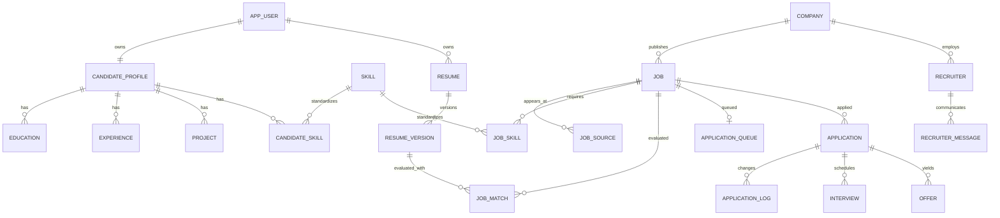

# JobPilot AI 数据库设计

> 数据库：MySQL 8.x  
> 字符集：`utf8mb4`，排序规则在建库时统一；所有时间以 UTC 入库、按用户时区展示。  
> 向量正文存储：Milvus；MySQL 保存业务主数据、向量引用与可追溯元数据。

## 1. 设计目标

- 支撑 Candidate → Job → Match → Queue → Application → Interview → Offer 的完整事务链路。
- 每次 AI 判断可追溯到候选人、简历、JD、权重、Prompt、模型和算法版本。
- 岗位多来源合并但保留来源证据，投递状态变化只追加日志，不覆盖历史。
- 当前单用户也在业务表保留 `user_id`，避免未来迁移时重写所有数据。
- JSON 只用于不稳定的原始快照和结果快照；常用筛选字段必须规范化成列或关系表。

### 1.1 Phase 1 物理表命名决议

Phase 1 的更具体实现要求采用复数物理表名。本文其余章节中的概念名按以下方式映射：`app_user → users`、`candidate_profile → candidate_profiles`、`education → educations`、`experience → experiences`、`project → projects`、`skill → skills`、`candidate_skill → candidate_skills`、`resume → resumes`、`resume_version → resume_versions`。新增的结构化简历分区使用 `resume_sections`。这一变化只影响物理命名，不改变领域边界和数据所有权。

## 2. 全局约定

除纯关系表外，每张业务表默认包含：

| 字段 | 类型 | 说明 |
|---|---|---|
| `id` | `BIGINT UNSIGNED` | 内部主键，雪花 ID 或应用侧分配，不暴露可枚举语义 |
| `public_id` | `CHAR(26)` | 对外 ULID，唯一索引；API 使用它 |
| `created_at` | `DATETIME(3)` | 创建时间 |
| `updated_at` | `DATETIME(3)` | 更新时间 |
| `deleted_at` | `DATETIME(3) NULL` | 逻辑删除；审计/日志类表通常禁止删除 |
| `version` | `INT UNSIGNED` | 需要并发控制的聚合根使用乐观锁 |

附加规则：

- 金额使用 `DECIMAL` 和单独的 `currency CHAR(3)`，不使用浮点数。
- 评分使用 `DECIMAL(5,2)`，范围由应用和 `CHECK` 双重限制在 0–100。
- 枚举列使用 `VARCHAR` + 应用枚举 + `CHECK`，避免 MySQL `ENUM` 难迁移。
- 长文本使用 `TEXT/MEDIUMTEXT`；查询用的技能、状态、公司等必须结构化。
- 所有 `user_id`、外键、状态、时间范围和高频排序字段建立组合索引。
- 逻辑唯一约束包含稳定业务键；逻辑删除后允许重建的数据使用“活动标记”策略或应用内串行化，不能仅依赖含 `NULL` 的唯一索引。
- 审计日志、AI 调用日志、Application Log 和 Outbox 为追加型数据，不执行普通逻辑删除。

## 3. ER 总览



## 4. 身份与审计

### 4.1 `users`（概念名 `app_user`）

物理表使用复数 `users`，避免与 SQL/框架保留词 `user` 混淆。

| 关键字段 | 类型 | 约束/说明 |
|---|---|---|
| `username` | `VARCHAR(64)` | 唯一、规范化后保存 |
| `email` | `VARCHAR(254)` | 可空；规范化值唯一 |
| `password_hash` | `VARCHAR(255)` | Argon2id/BCrypt 哈希，永不返回 API |
| `status` | `VARCHAR(24)` | `ACTIVE/LOCKED/DISABLED` |
| `timezone` | `VARCHAR(64)` | 默认 `Asia/Shanghai` |
| `locale` | `VARCHAR(16)` | 默认 `zh-CN` |
| `last_login_at` | `DATETIME(3)` | 可空 |

索引：`uk_user_username`、`uk_user_email`。

### 4.2 `refresh_token`

保存 Refresh Token 哈希、Token Family、过期/撤销时间、设备摘要。Token 原文只在签发时返回一次。索引：`token_hash` 唯一、`(user_id, expires_at)`。

### 4.3 `audit_log`

字段：`user_id`、`actor_type`、`action`、`resource_type`、`resource_public_id`、`result`、`trace_id`、`ip_masked`、`user_agent_hash`、`detail_json`、`created_at`。不得保存密码、Authorization、Cookie、API Key 或简历全文。

## 5. Candidate Digital Twin

### 5.1 `candidate_profile`

| 字段组 | 字段 |
|---|---|
| 身份 | `user_id`（唯一）、`full_name`、`gender_optional`、`birth_year_optional` |
| 联系方式 | `phone_encrypted`、`phone_masked`、`email_encrypted`、`email_masked` |
| 求职 | `graduate_year`、`highest_degree`、`target_job_summary`、`salary_min`、`salary_max`、`currency` |
| 地点 | `current_city`、`target_cities_json` |
| 链接 | `github_url`、`portfolio_url` |
| 偏好摘要 | `acceptance_summary`、`rejection_summary` |
| AI 元数据 | `source_resume_version_id`、`fact_version`、`confirmed_at` |

用户必须确认 AI 抽取出的事实后，`confirmed_at` 才有值。匹配默认只使用已确认事实。

### 5.2 `education`

字段：`candidate_profile_id`、`school_name`、`major`、`degree`、`start_date`、`end_date`、`graduation_year`、`gpa_text`、`description`、`display_order`、`is_confirmed`。

### 5.3 `experience`

字段：`candidate_profile_id`、`organization_name`、`title`、`employment_type`、`start_date`、`end_date`、`location`、`responsibilities`、`achievements`、`fact_tags_json`、`display_order`、`is_confirmed`。

### 5.4 `project`

字段：`candidate_profile_id`、`name`、`role`、`start_date`、`end_date`、`summary`、`responsibilities`、`achievements`、`tech_stack_json`、`project_url`、`evidence_json`、`display_order`、`is_confirmed`。

`evidence_json` 只引用候选人已提供的原文位置/事实，不生成外部证明。

### 5.5 `skill`

技能本体主表：`canonical_key`（如 `spring_boot`，唯一）、`display_name`、`category`、`description`、`status`。

### 5.6 `skill_alias`

字段：`skill_id`、`alias_normalized`、`alias_display`、`language`、`source`。唯一索引：`alias_normalized`。

### 5.7 `skill_relation`

字段：`from_skill_id`、`to_skill_id`、`relation_type`（`PARENT/RELATED/ALTERNATIVE/PART_OF`）、`weight`、`source`。唯一索引：三元组。

### 5.8 `candidate_skill`

字段：`candidate_profile_id`、`skill_id`、`proficiency`（0–100）、`years_optional`、`last_used_at`、`evidence_type`、`evidence_ref_id`、`is_confirmed`。唯一索引：`(candidate_profile_id, skill_id, deleted_at)` 由应用层保证活动唯一。

### 5.9 `preference`

可版本化偏好：`user_id`、`preference_type`（岗位/城市/行业/规模/薪资/条件等）、`key_name`、`value_json`、`weight`、`is_hard_constraint`、`effective_from`、`effective_to`。

### 5.10 `blacklist`

字段：`user_id`、`target_type`（`COMPANY/INDUSTRY/JOB_KEYWORD/RECRUITER`）、`target_id_optional`、`pattern_optional`、`reason`、`severity`（`BLOCK/DOWNGRADE/WARN`）、`active`。索引：`(user_id, target_type, active)`。

## 6. Resume Center

### 6.1 `file_object`

字段：`user_id`、`storage_provider`、`object_key`、`original_name`、`media_type`、`size_bytes`、`sha256`、`encryption_state`、`scan_status`。`object_key` 唯一；下载必须通过授权后的短时 URL/流式接口。

### 6.2 `resume`

| 字段 | 说明 |
|---|---|
| `user_id` | 所属用户 |
| `name` | 如 Master Resume |
| `resume_type` | `MASTER/DERIVED`；当前 Master 使用 `MASTER` |
| `status` | `DRAFT/ACTIVE/ARCHIVED` |
| `current_version_id` | 当前激活版本，可空，应用层维护 |

同一用户只允许一个活动 `MASTER`。

### 6.3 `resume_version`

字段：`resume_id`、`parent_version_id`、`version_no`、`direction`（`JAVA_BACKEND/JAVA_AI/AI_APPLICATION/FULL_STACK/CUSTOM`）、`title`、`content_json`、`source_file_id`、`rendered_file_id`、`content_sha256`、`tailored_for_job_id`、`prompt_template_id`、`model_name`、`truth_check_status`、`status`、`created_by_type`。

唯一索引：`(resume_id, version_no)`；针对岗位生成的简历必须保存父版本和事实核验结果。

### 6.4 `resume_version_metric`

字段：`resume_version_id`、`period_start`、`period_end`、`use_count`、`application_count`、`reply_count`、`interview_count`、`offer_count`。回复率等派生值查询时计算，防止计数与比率漂移。

Phase 6 实际物理表为 `resume_version_metrics`，按当前 Resume Version 唯一保存 `queue_use_count/application_count/reply_count/interview_count/offer_count` 与 `calculated_at`；服务每次从 Queue 和不可变 Application Log 重算，不把缓存计数当作唯一事实源。

### 6.5 `candidate_evidence_items`、`resume_tailor_runs` 与 `resume_tailor_changes`（Phase 6 已实现）

`candidate_evidence_items` 以 `(user_id, evidence_key, version_no)` 版本化 Profile、Education、Experience、Project、Skill 和 Master Resume Section；相同内容 Hash 不重复创建，历史证据不覆盖。`resume_tailor_runs` 保存 Job、基准/目标 Resume、Prompt、AI Call、幂等键、输入/证据快照 Hash、真实性结果和批准版本；`resume_tailor_changes` 逐项保存 Section、操作、Before/After、Reason 和 Evidence Refs。批准只新增 Resume Version，不更新基准版本。

## 7. Company、Recruiter 与 Job

### 7.1 `company`

字段：`normalized_name`、`display_name`、`website`、`industry`、`company_size`、`financing_stage`、`headquarters_city`、`description`、`verified_source`、`risk_flags_json`。索引：`normalized_name`、`industry`。

### 7.2 `recruiter`

字段：`company_id`、`name`、`position`、`platform`、`platform_recruiter_id`、`contact_encrypted`、`contact_masked`、`last_contact_at`、`next_follow_up_at`、`communication_status`。平台身份有值时唯一索引 `(platform, platform_recruiter_id)`。

### 7.3 `recruiter_message`

字段：`user_id`、`recruiter_id`、`application_id`、`direction`（`INBOUND/OUTBOUND/DRAFT`）、`channel`、`message_type`、`content_encrypted`、`content_masked_preview`、`occurred_at`、`sent_by`、`external_message_id`。AI 只能创建 `DRAFT`，不能直接改为 `OUTBOUND`。

### 7.4 `job`

| 类别 | 字段 |
|---|---|
| 归属 | `user_id`、`company_id` |
| 标识 | `normalized_title`、`title`、`fingerprint_hash`、`canonical_job_key` |
| 地点 | `city`、`district`、`workplace_text` |
| 薪资 | `salary_min`、`salary_max`、`salary_months`、`currency`、`salary_text` |
| 门槛 | `education`、`experience_min_years`、`experience_max_years`、`graduate_year`、`job_type` |
| JD | `description_raw`、`description_clean`、`responsibilities_json`、`requirements_json` |
| 业务 | `business_domain`、`team_name` |
| 时间 | `publish_at`、`first_collected_at`、`last_collected_at`、`closed_at` |
| 状态 | `status`（`DISCOVERED/PARSED/ACTIVE/EXPIRED/CLOSED/IGNORED`）、`parse_status` |
| 解析 | `parser_version`、`raw_content_hash`、`parse_result_json` |

主要索引：

- `(user_id, status, publish_at DESC)`
- `(user_id, city, status, publish_at DESC)`
- `(company_id, normalized_title, city)`
- `fingerprint_hash`
- `(user_id, parse_status, created_at)`

### 7.5 `job_source`

同一规范岗位的多个平台来源：`job_id`、`platform`、`platform_job_id`、`source_type`、`job_url`、`source_title`、`source_company_name`、`recruiter_id`、`raw_snapshot_json`、`publish_at`、`collected_at`、`last_seen_at`、`availability_status`、`collector_version`、`user_initiated`。

唯一索引优先 `(platform, platform_job_id)`；缺少平台 ID 时使用 `(platform, normalized_url_hash)`。

### 7.6 `job_skill`

字段：`job_id`、`skill_id`、`requirement_type`（`MUST_HAVE/NICE_TO_HAVE/RELATED`）、`importance`、`min_years`、`evidence_text`、`source`、`confidence`。唯一索引：`(job_id, skill_id, requirement_type)`。

### 7.7 `job_embedding`

字段：`job_id`、`entity_type`、`entity_id`、`vector_store`、`collection_name`、`vector_id`、`embedding_provider`、`embedding_model`、`dimension`、`content_hash`、`embedding_version`、`status`、`embedded_at`。

唯一索引：`(entity_type, entity_id, embedding_model, content_hash)`；向量值不重复存 MySQL。

### 7.8 `job_import_task`

字段：`user_id`、`import_type`（`MANUAL/URL/EXTENSION/CSV/EXCEL`）、`file_id`、`source_url`、`idempotency_key`、`status`、`total_count`、`success_count`、`failure_count`、`error_summary_json`。导入行级错误可单独落 `job_import_error`。

### 7.9 去重策略

1. 精确层：平台 + platformJobId 或规范 URL。
2. 规则层：`company.normalized_name + normalized_title + city`。
3. 语义层：JD Embedding 余弦相似度达到版本化阈值。
4. 合并只新增/更新 `job_source`，不重复创建 `job`；冲突字段保留来源优先级和人工确认。
5. 保存 `fingerprint_hash`、算法版本、候选 Job ID、相似度和决策到 `job_dedup_log`，保证可解释和可撤销。

`job_dedup_log` 字段：`incoming_source_id`、`candidate_job_id`、`rule_score`、`embedding_score`、`decision`、`algorithm_version`、`decided_by`、`detail_json`。

### 7.10 Phase 2 物理迁移映射

Flyway `V2__job_center.sql` 采用与 Phase 1 一致的复数物理表名：`companies`、`skill_aliases`、`jobs`、`job_sources`、`job_skills`、`job_import_tasks`、`job_import_errors`、`job_parse_runs`、`job_dedup_logs`、`job_revision_logs`。本节前述单数名保留为逻辑模型名称。

- `job_import_errors.source_row_number` 避免 MySQL 8.4 保留词 `ROW_NUMBER`，Java 字段仍暴露为 `rowNumber`。
- `job_parse_runs` 保存 Parser Mode/Version、Schema/Prompt/Model 版本、输入输出 Hash、结果或安全错误；历史记录不覆盖。
- `job_revision_logs` 保存人工修订前后快照、字段集、原因和 Trace ID；解析器不得覆盖 `jobs.manual_fields_json` 中标记的人工字段。
- V2 只实现精确与规则去重，当时未创建占位表或假向量。Phase 3 已通过 V3 的 `entity_embeddings` 元数据与 Milvus Collection 落地真实 BGE-M3 向量；岗位语义去重仍不在 Phase 3 匹配范围内。

## 8. Matching 与 Recommendation

Flyway `V3__matching_engine.sql` 使用复数物理表：`match_configs`、`hard_filter_rules`、`skill_relations`、`match_runs`、`ai_call_logs`、`job_matches`、`job_match_details`、`entity_embeddings`、`outbox_events`。`job_matches` 保存权重/阈值/算法/模型/Prompt 快照；`match_runs + outbox_events` 提供事务内创建、异步消费、幂等、退避重试和 DEAD 状态。Milvus 保存向量正文，MySQL 只保存可追溯引用、模型、维度、内容 Hash 和状态。

### 8.1 `match_config`

字段：`user_id`、`name`、`version_no`、`weights_json`、`level_thresholds_json`、`penalties_json`、`active`、`effective_at`。激活后不原地修改，生成新版本。

### 8.2 `hard_filter_rule`

字段：`user_id`、`name`、`rule_type`、`operator`、`operand_json`、`result_action`（`REJECT/DOWNGRADE/WARN`）、`penalty`、`priority`、`active`、`version_no`。规则解释器只允许白名单操作符，不执行用户脚本。

### 8.3 `job_match`

| 字段 | 说明 |
|---|---|
| `user_id/job_id` | 归属与岗位 |
| `candidate_profile_id` | 使用的画像版本 |
| `resume_version_id` | 使用的简历版本，可空 |
| `match_config_id` | 权重配置快照来源 |
| `hard_filter_result` | `PASS/DOWNGRADE/REJECT` |
| `skill_score` | 技能分 |
| `embedding_score` | 向量分 |
| `llm_score` | LLM 汇总分 |
| `project_score` | 项目分 |
| `preference_score` | 个人偏好分 |
| `company_score` | 公司偏好分 |
| `penalty_score` | 惩罚分 |
| `overall_score` | 最终分 |
| `level` | `S/A/B/C/D` |
| `advantages_json/gaps_json/risks_json` | 结构化解释 |
| `recommendation/reason` | 简洁结论 |
| `algorithm_version` | 评分代码版本 |
| `ai_call_id` | 对应 AI 调用 |
| `status/evaluated_at` | 任务状态和完成时间 |

唯一活动结果由 `(job_id, candidate_profile_id, resume_version_id, match_config_id, input_hash)` 识别；重算产生新行，旧结果保留用于回溯。

### 8.4 `job_match_detail`

保存维度级证据：`job_match_id`、`dimension`、`item_key`、`candidate_evidence_ref`、`job_evidence_text`、`score`、`decision`、`explanation`。用于 UI 展示“为什么”。

### 8.5 `job_recommendations`（Phase 4 已实现）

字段：`user_id`、`job_id`、`latest_match_id`、`recommendation_status`（`UNEVALUATED/READY/MATCH_FAILED/IGNORED`）、`favorite`、`rank_score`、`rank_version`、`rank_basis_json`、`ignored_reason`、`ignored_at`、`last_evaluated_at` 和乐观锁版本。`(user_id, job_id, active_marker)` 保证每个岗位只有一个活动投影；收藏与推荐状态正交。

### 8.6 `recommendation_events` 与批量刷新（Phase 4 已实现）

`recommendation_events` 追加保存 `FAVORITE/UNFAVORITE/IGNORE/RESTORE`、前后状态 JSON、特征快照、Match 引用和 Trace ID，不更新历史。

`recommendation_refresh_runs` 使用 `(user_id, idempotency_key)` 唯一约束保存批量条件和计数；`recommendation_refresh_items` 以 `(refresh_run_id, job_id)` 唯一关联 Phase 3 `match_runs`。批量层不复制评分逻辑。

## 9. Application Queue 与 CRM

### 9.1 `application_queue_items`（Phase 5 已实现）

字段：`user_id`、`job_id`、`job_match_id`、`resume_version_id`、`greeting_reference`、`mode`（`MANUAL/ASSIST/AUTHORIZED_AUTOMATION`）、`status`（`WAITING/READY/NEED_REVIEW/APPROVED/PREPARED/SUCCESS/FAILED/SKIPPED/BLOCKED`）、`priority`、`scheduled_at`、`approved_at`、`approved_by`、`prepared_at`、`idempotency_key`、`request_hash`、`last_error_code`、`last_error_message`。

一个用户/岗位最多一个非终态队列项；通过生成列唯一索引、事务和 Redis 幂等短锁共同保证。`SUCCESS` 表示用户明确确认外部投递后成功建立 CRM 事实，不表示 JobPilot 自动提交。

### 9.2 `applications`（Phase 5 已实现）

字段：`user_id`、`job_id`、`job_source_id`、`resume_version_id`、`recruiter_id`、`queue_item_id`、`status`、`application_mode`、`applied_at`、`last_status_at`、`external_application_id`、`source_url_snapshot`、`notes`、`idempotency_key`、`request_hash`。

CRM 状态：

```text
Recommendation/Queue 负责 DISCOVERED → MATCHED → FAVORITE → READY；CRM 从 APPLIED 开始：
APPLIED → VIEWED → REPLIED
REPLIED → WRITTEN_TEST | INTERVIEW_1 | HR_INTERVIEW
INTERVIEW_1 → INTERVIEW_2 → INTERVIEW_3 → HR_INTERVIEW → OFFER
任意允许节点 → REJECTED | WITHDRAWN | CLOSED
```

状态迁移白名单由代码定义并测试；不能直接更新 SQL 绕过应用服务。

### 9.3 `application_logs`（Phase 5 已实现）

字段：`application_id`、`from_status`、`to_status`、`event_type`、`occurred_at`、`source`（`USER/PLATFORM_IMPORT/AUTOMATION/SYSTEM`）、`actor_user_id`、`note`、`evidence_json`、`trace_id`。追加写，不更新历史。

### 9.4 `recruiters` 与 `recruiter_interactions`（Phase 5 已实现）

`recruiters` 保存当前用户归属、Company、姓名/职位、平台标识、脱敏联系方式、跟进时间和沟通状态；`recruiter_interactions` 只追加用户人工记录的渠道、方向、摘要、发生时间与 Application 引用，不提供外部发送能力。

### 9.5 `communication_drafts`（Phase 6 已实现）

字段：`user_id`、`job_id`、`application_id`、`resume_version_id`、`recruiter_id`、`channel`、`purpose`、`content`、`char_count`、`evidence_refs_json`、`prompt_template_id`、`ai_call_id`、`execution_mode`、`truth_check_status`、`status`（`DRAFT/APPROVED/USED/ARCHIVED`）、幂等键与请求 Hash。生成、批准和标记使用都不等于发送；表中没有外发成功字段。

## 10. Interview 与 Offer

### 10.1 Interview 聚合（Phase 8 已实现）

`interviews` 保存当前用户、可选 Application/Job/Company/Resume Version 引用、Company/Role 快照、状态、结果、时区、备注、逻辑删除和乐观锁。Interview 必须关联可访问的 Job/Application，或提供人工 Company/Role 快照；创建 Interview 不改变 Application 状态。

`interview_rounds` 保存轮次号、类型、标题、起止时间、时区、形式、会议链接/地点、面试官、状态和结果。同一活动 Interview 的轮次号唯一，结束时间必须晚于开始时间，删除为逻辑删除。

### 10.2 Question 与 Answer Note（Phase 8 已实现）

`interview_questions` 使用 `source_type=PREDICTED/ACTUAL/MANUAL` 明确来源，保存分类、难度、问题、目的、依据、回答框架、追问、风险、Evidence 引用和 AI 调用元数据。预测幂等键覆盖用户、Round、请求语义 Hash 和显示顺序。

`interview_answer_notes` 只保存用户主动输入的回答记录；`(question_id, note_version)` 唯一，修改通过追加新版本而不是覆盖旧回答。

### 10.3 不可变 Review（Phase 8 已实现）

`interview_reviews` 使用 `(interview_id, review_version)` 保存不可变历史，并保存状态、请求 Hash、Prompt/模型/AI Call、Evidence 和人工确认人/时间。`interview_review_items` 结构化保存 Strength、Weakness、Expression Issue、Project Risk、Next Action 和 Knowledge Gap 建议。相同幂等键只返回同一版本，不静默覆盖。

### 10.4 Knowledge Gap 与 Reminder（Phase 8 已实现）

`knowledge_gaps` 和 `knowledge_gap_evidence` 保存来源 Interview/Review/Item、严重度、事实与推断证据、建议动作以及确认/解决/忽略时间。AI 只能创建 `PROPOSED`；来源 Review 经用户确认后，用户仍需逐条将 Gap 激活为 `ACTIVE`。

`interview_reminders` 保存站内 `PREPARE/START/REVIEW/CUSTOM` 待办及 `PENDING/DONE/CANCELLED` 状态。同一 Interview/Round/类型/时间只能存在一个活动提醒；改期使用乐观锁。该表不代表外部通知或第三方日历事件。

### 10.5 `offer`

字段：`application_id`、`company_id`、`base_salary`、`salary_months`、`currency`、`bonus_text`、`housing_text`、`benefits_json`、`work_time_text`、`overtime_text`、`location`、`probation_months`、`probation_salary_ratio`、`start_date`、`deadline_at`、`status`、`comparison_score`、`score_breakdown_json`、`notes`。

敏感 Offer 信息默认不发送至外部模型；需要比较时先做字段最小化并征得设置层授权。

## 11. Automation、Analytics 与 Learning

### 11.1 `automation_rules`

字段：`user_id`、`name`、`rule_type`、`schedule_expression`、`timezone`、`config_json`、`enabled`、`status`、`max_attempts`、`last_run_at`、`next_run_at`、逻辑删除和乐观锁。规则只允许七个预定义本地 Handler。

### 11.2 `safe_automation_tasks`

字段：`automation_rule_id`、`task_type`、`idempotency_key`、`request_hash`、`status`、`input_json`、`output_json`、`attempt_count`、`max_attempts`、`scheduled_at`、`next_retry_at`、`started_at`、`finished_at`、`error_code`、`error_message_safe`、`trace_id`。Check Constraint 强制外部消息/提交/变更均为 0，并强制最终用户确认。

### 11.3 `platform_policy`

字段：`platform`、`collection_mode`、`application_mode`、`requires_final_confirmation`、`rate_limit_json`、`policy_source_url`、`reviewed_at`、`status`。未知/过期策略默认限制为 `MANUAL_ONLY`。

### 11.4 `automation_authorizations`

字段：`user_id`、`platform`、`scopes_json`、`scope_hash`、`evidence_type`、`evidence_ref`、`granted_at`、`expires_at`、`revoked_at`、`status`。没有有效授权不能进入授权分支；Phase 10 即使有授权也没有外部自动提交 Handler。

### 11.5 `analytics_daily`

Phase 4 基础字段：`user_id`、`metric_date`、`dimension_type`（`OVERALL/SOURCE/CITY/LEVEL/RECOMMENDATION_STATUS`）、`dimension_key`、`job_count`、`evaluated_count`、`high_match_count`、`favorite_count`、`ignored_count`。活动唯一索引：`(user_id, metric_date, dimension_type, dimension_key, active_marker)`。

Phase 5 增加 `queued_count`、`applied_count`、`viewed_count`、`replied_count`、`written_test_count`、`interview_stage_count`、`offer_stage_count`、`terminal_count`，由 Queue 创建和不可变 Application Log 事件重算；阶段到达数按唯一 Application 计数，不以当前状态覆盖历史到达事实。

### 11.6 `feedback`

字段：`user_id`、`job_id`、`job_match_id`、`application_id`、`source_type`、`source_public_id`、`event_type`、`label_value`、`occurred_at`、`feature_schema_version`、`feature_snapshot_json`、`feature_hash`、`source`。来源事件唯一约束保证幂等；Feedback 从实际状态事件生成，不覆盖原评分。

### 11.7 `feedback_rebuild_runs`、`ltr_training_runs`、`ltr_model_versions` 与 `ltr_shadow_results`

Rebuild/Training Run 保存幂等键、请求 Hash、时间窗口、样本切分、泄漏检查、指标和状态；Model Version 保存 Feature Schema、参数、训练窗口、样本量、评估与状态，每用户最多一条活动版本；Shadow Result 保存当前/候选分数与名次，不修改在线投影。样本量不足时只输出统计建议，不创建可激活模型。

## 12. Settings、Prompt 与 AI 调用

### 12.1 `system_settings`

字段：`user_id`、`setting_group`、`setting_key`、`value_json`、`value_type`、`is_sensitive`、`encrypted_value`、`effective_at`。Phase 14 已实现固定白名单内的非敏感、强类型用户设置；敏感值不允许出现在 `value_json`，本阶段也不开放敏感设置写入。环境变量继续优先于数据库配置。

### 12.2 `prompt_templates`（Phase 6 已实现）

字段：`template_key`、`version_no`、`display_name`、`system_prompt`、输入/输出 Schema 版本、`prompt_hash`、`active`、`created_by`。同一 Key/版本唯一，生成列保证每个 Key 最多一个活动模板。V6 初始化 `RESUME_TAILOR v1` 与 `COMMUNICATION_DRAFT v1`。

### 12.3 `ai_call_logs`（Phase 3 已实现，Phase 6 扩展）

字段：`user_id`、`task_type`、`provider`、`model`、`prompt_template_id`、`prompt_hash`、`request_redacted_json`、`response_redacted_json`、`input_tokens`、`output_tokens`、`estimated_cost`、`currency`、`duration_ms`、`status`、`error_code`、`trace_id`、`started_at`、`finished_at`。

默认只保存脱敏摘要和 Hash；全文是否保存由隐私设置控制。

Phase 6 没有重复创建 AI Call 表，而是在既有 `ai_call_logs` 增加 `prompt_template_id` 外键，使 Match、Tailor 与 Communication 共用同一审计事实模型。

### 12.4 `outbox_event`

字段：`aggregate_type`、`aggregate_id`、`event_type`、`payload_json`、`status`、`available_at`、`attempt_count`、`locked_by`、`locked_at`、`published_at`、`last_error_safe`。索引：`(status, available_at)`。

## 13. 核心约束与并发

1. `application.status` 只能通过状态机应用服务变更，同一事务追加 `application_log`。
2. Job 去重合并、加入队列、创建 Application 和 Refresh Token 轮换均使用幂等键。
3. 队列项、Match Config、Resume Version、Application 使用 `version` 乐观锁。
4. `job_match`、`resume_version`、`prompt_template` 和配置采用不可变版本；修改即创建新版本。
5. 外键默认 `RESTRICT`；仅明确的纯子记录允许 `CASCADE`。业务聚合删除由服务编排并审计。
6. `AI SUCCESS` 不等于业务成功；Backend 必须完成 Schema 和真实性规则校验后才能落业务结果。

## 14. 索引与查询计划基线

- 岗位列表：`(user_id, status, publish_at DESC, id DESC)`，使用游标分页。
- 推荐列表：`(user_id, status, rank_score DESC, id DESC)`。
- 队列：`(user_id, status, priority DESC, scheduled_at, id)`。
- Application CRM：`(user_id, status, last_status_at DESC, id DESC)`。
- 待跟进 Recruiter：`(user_id, communication_status, next_follow_up_at)`（通过归属或冗余 user_id）。
- 面试提醒：`(user_id, status, remind_at, id)`；Offer 截止：`(status, deadline_at)`。
- AI/Automation Worker：`(status, available_at)`，使用 `SELECT ... FOR UPDATE SKIP LOCKED` 领取。
- 慢查询阈值、执行计划和索引命中在 Phase 4/9 使用真实规模数据复核，禁止为所有字段盲目建索引。

## 15. 数据迁移与种子数据

- 使用 Flyway，文件名 `V<version>__<description>.sql`；已发布迁移禁止修改。
- 参考技能别名、默认权重和状态字典使用可重复迁移 `R__*.sql` 或版本化 Seed Service。
- Demo 数据必须使用独立 `demo` Profile，名称和页面明确带 `DEMO`；生产 Profile 不自动写 Demo 数据。
- 初始管理员通过一次性引导创建，不在迁移中写默认密码。

## 16. 备份与保留

- 每日备份 MySQL；文件对象和 Milvus 元数据使用同一备份批次标识。
- 至少保留最近 7 个日备份和 4 个周备份，具体值可配置。
- 每个 Phase 的恢复演练至少验证一次“空库 → Flyway → 恢复 → 核心查询”。
- 审计与状态日志默认长期保留；AI 脱敏请求/响应按保留策略清理。
- 逻辑删除到期后由显式、可审计、可预览的清理任务物理删除。

## 17. Phase 1 首批迁移范围

Phase 1 只实现并验证以下表，避免一次性创建所有空表：

1. `users`、`refresh_tokens`、`audit_logs`
2. `candidate_profiles`、`educations`、`experiences`、`projects`
3. `skills`、`candidate_skills`
4. `resumes`、`resume_versions`、`resume_sections`

`skill_aliases` 已在 Phase 2 随 Job Parser 的真实归一化链路创建；`system_settings` 已在 Phase 14 随真实账户设置链路创建。`preferences` 与 `file_objects` 仍延后到出现真实业务链路时再迁移，不创建无人使用的空表。

后续表随对应 Phase 用 Flyway 增量引入。
## Phase 7 / Flyway V7

V7 adds `extension_pairing_codes`, `extension_devices`, `extension_refresh_tokens`, `automation_tasks` and append-only `automation_task_steps`. Pairing and refresh secrets are persisted only as SHA-256 hashes. Database CHECK constraints force every automation task to keep `externally_submitted=0`, `application_created=0` and `final_confirmation_required=1`; task status is limited to `PENDING/RUNNING/PREPARED/BLOCKED/FAILED/CANCELLED`.

The existing database migrated from V6 to V7 with 54 total tables. No Hibernate DDL is used.

## Phase 8 / Flyway V8

V8 adds 9 tables: `interviews`, `interview_rounds`, `interview_questions`, `interview_answer_notes`, `interview_reviews`, `interview_review_items`, `knowledge_gaps`, `knowledge_gap_evidence` and `interview_reminders`. The schema has 63 tables after V8. The earlier conceptual single-row Interview/single Review design was replaced because it could not preserve multiple rounds, immutable Review history, append-only Answer Notes or per-gap human decisions. Both V7→V8 upgrade and V1→V8 clean-room migration were verified against real MySQL 8.4.

## Phase 9 / Flyway V9

V9 新增 `offers`、`offer_benefits`、`offer_comparisons`、`offer_comparison_items`、`offer_deadlines`、`analytics_snapshots` 和 `privacy_operation_requests` 共 7 张表，迁移后共 70 张表。Offer 通过 `(application_id, active_marker)` 约束每个 Application 只能存在一条活动记录；金额使用定点小数，Deadline 保存 UTC 与 IANA 时区，所有可变聚合均带逻辑删除和乐观锁版本。

Comparison 保存权重、主观评分、输入 Hash、输入快照和结果项，旧版本不可覆盖；Analytics Snapshot 保存日期范围、Schema Version、输入 Hash 和完整结果 JSON。Privacy Operation 保存预览计数快照、确认 Hash、状态和完成时间，但不保存明文密码、Token 或确认短语。V8→V9 升级和临时空库 V1→V9 均在 MySQL 8.4 实测通过。Offer 备注等用户主动输入只在本地数据库中按最小 API 暴露并禁止日志输出；使用独立可轮换主密钥的通用字段加密尚未实现，不能以 JWT Secret 代替，记录为后续安全技术债。

## Phase 10 / Flyway V10

V10 新增 `feedback`、`feedback_rebuild_runs`、`ltr_training_runs`、`ltr_model_versions`、`ltr_shadow_results`、`automation_rules`、`safe_automation_tasks`、`automation_suggestions`、`automation_notifications` 和 `automation_authorizations` 共 10 张表，迁移后共 80 张表。V9→V10 升级和临时空库 V1→V10 均在 MySQL 8.4 实测通过；数据库安全约束的负向写入测试确认外部消息、提交或变更标志不能被置为 1。

## Phase 11 / Flyway V11

V11 新增 `ai_budget_policies` 与 `operational_runs`，迁移后共 82 张表。

- `ai_budget_policies`：每用户一条活动策略，保存日/月 Token 上限、日/月成本上限、币种、告警百分比、启用状态和乐观锁版本；不保存 Provider Secret，不做无来源汇率换算。
- `operational_runs`：保存 Backup、Restore Drill、Dependency/Secret/License/Container Scan 与 Load Test 的批次、状态、脱敏指标、Manifest 相对路径、SHA-256、RPO/RTO 和错误码。`(run_type, batch_id, active_marker)` 保证幂等，Artifact Path 禁止绝对路径和目录穿越。

既有库 V10→V11 与临时空库 V1→V11 均通过真实 MySQL 8.4 迁移验证。备份恢复使用独立随机数据库和临时 Milvus Collection；活动数据库不作为脚本参数暴露。

## Phase 14 / Flyway V12

V12 扩展 `users`：增加 `timezone`、`locale`、`password_changed_at` 和单调递增的 `auth_version`；扩展 `refresh_tokens`：增加客户端类型/标签、User-Agent Hash、脱敏 IP、最后使用时间等 Session Metadata。新增 `system_settings`，以 `(user_id, setting_group, setting_key)` 唯一约束保存当前用户非敏感、强类型白名单设置，并保留逻辑删除与乐观锁字段。

Phase 0 概念名 `system_setting` 与实际表命名约定冲突，Phase 14 统一为复数 `system_settings`。不在数据库保存明文密码、Token、完整 User-Agent 或完整 IP。既有库 V11→V12 和临时空库 V1→V12 均通过真实 MySQL 8.4 迁移，Flyway 为 12，共 83 张表。
